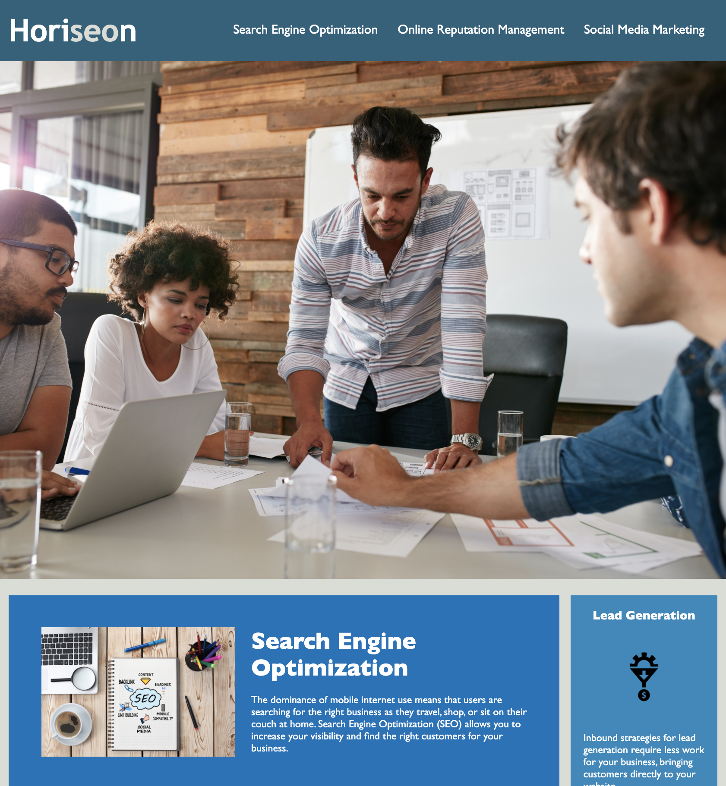

# Refactoring Horiseon Code Base

Horiseon Marketing Agency approached us to refactor their code so that it follows accesibility standards and enhance search engine optimization. 

The following changes were made:

- Changed HTML elements to semantic elements
- Refactored HTML elements to follow logical structure
- Added accessible alt attributes
- Ensured heading attributes fall in sequential order
- Changed the title to be concise and descriptive 
- Ensured the CSS file was properly commented
- Ensured CSS selectors and properties were consolidated and organized to follow semantic structure

After implementing the suggested changes, we tested the site to ensure it still maintained appearance and functionality:

The refactored code can be found in the provided folders.

## Support
Feel free to reach out if you have any questions or suggestions. My email is johanneschitura@gmail.com.

